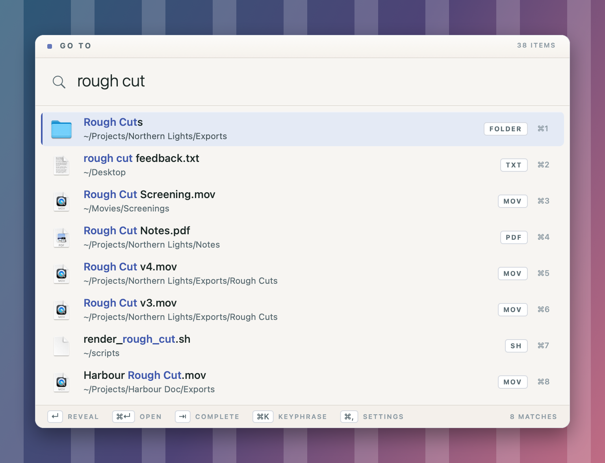
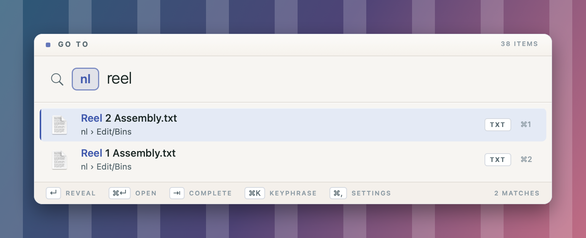

# Go To

A Spotlight-style popup that finds a file or folder and reveals it in Finder. It reuses your most recent Finder window, or opens a new one if none are open. If you use the [AeroSpace](https://github.com/nikitabobko/AeroSpace) tiling window manager, it also switches to the workspace that window is on.

<p align="center">
  
</p>

Type a keyphrase and a space to lock it in as a token, then search inside its folder:

<p align="center">
  
</p>

## Download

Grab `GoTo-<version>.zip` from the [latest release](https://github.com/absolute-cinema-jpg/go-to/releases/latest). It needs macOS 12 Monterey or later and runs on Apple silicon and Intel Macs. Unzip it and move `GoTo.app` to `/Applications`.

The app isn't notarized by Apple (that needs a paid developer account), so the first launch is blocked with "Apple cannot check it for malicious software". To allow it:
- **macOS 12–14:** right-click `GoTo.app` → **Open** → **Open**.
- **macOS 15 and later:** try to open it once, then go to **System Settings › Privacy & Security** and click **Open Anyway**.

You only need to do this once. You can check the download against the SHA-256 checksum in the release notes, or build it yourself from source (below).

## Build & install

```bash
./build.sh --install
```

This compiles `GoTo.app`, copies it to `/Applications` and launches it. It needs only the Xcode Command Line Tools, not the full Xcode. The app runs in the background with a menu bar icon, which you can turn off.

On first launch macOS asks for:
- **Desktop / Documents / Downloads** access, so those folders can be indexed. You can grant Full Disk Access instead.
- **Automation → Finder** the first time you reveal something. This lets the app select items in Finder.
- **Keychain** access for "Go To storage key". This key encrypts the saved index and history.

The app is ad-hoc signed (no developer certificate), so after a rebuild macOS may ask for these again. For the keychain prompt, choose **Always Allow**.

## Opening Go To

Run this shell command from a keyboard shortcut to open Go To:

```bash
open -g goto://toggle
```

macOS Shortcuts, Keyboard Maestro, Raycast, BetterTouchTool and similar apps can all run it from a hotkey. You can also click the menu bar icon or open `GoTo.app` from Spotlight. Swap `toggle` for `show`, `show?q=text`, `hide`, `settings` or `reindex` to do something else.

## Searching

| Typed | Result |
| --- | --- |
| `pph` (a keyphrase) | Jumps straight to its target |
| `proj` | Fuzzy match against every indexed name (word starts and consecutive letters rank higher) |
| `phil src` | Last word matches the name, earlier words match parent folders |
| `documnets` | Typo-tolerant fallback when nothing matches well |
| `~/Doc…`, `/usr/lo…` | Live path browsing |
| `pph/sub` | Browse inside a keyphrase's folder |
| `pph tmp` | Typing a keyphrase and a space locks it into a token (`[pph] tmp`); the rest searches everything inside its folder, at any depth. Backspace right after the token removes it in one go. With nothing typed after the token, it lists the folder's contents. Works even if the folder isn't indexed (e.g. on another volume); it's scanned on demand and kept in memory. |

| `deploy` (a command keyword) | ↵ runs its shell command. `deploy` + space locks it in (`[$ deploy] staging`); the rest is passed as arguments. |

Items you open often are ranked higher. When the box is empty, it shows your recent items.

**Keys:** ↵ reveal · ⌘↵ open (enter the folder, or open the file) · ⇥ complete the path · ↑↓ / ⌃N ⌃P move · ⌘1–8 reveal that result · ⌘K add a keyphrase for the selected result · ⌘C copy the path · ⌘, settings · esc close

## Settings

The settings window has four sections:
- **Keyphrases:** add, edit or remove them, or drop files and folders onto the list. Type or paste a target path directly (`~` works), or pick one with **Choose…**.
- **Commands:** keywords that run shell commands. Type a keyword and a command into the top row and press ↵ to add one. Each runs in the background (a notice appears only if it fails; click it to copy the output) or in a Terminal window. Commands can span several lines (⇧↵ for a new line). While a background command runs, a stop button appears in the menu bar; clicking it ends the command and everything it started. Arguments typed after the keyword arrive as `$1`, `$2`… (`"$@"`), with the whole text in `$GOTO_QUERY`. Commands run in zsh as you, from your home folder.
- **Index:** choose search locations and exclusions (by folder name like `node_modules`, or by path like `~/Library`). You can also include hidden files and rebuild the index.
- **General:** menu bar icon, launch at login, and the hotkey command.

Settings are stored as plain JSON at `~/Library/Application Support/GoTo/config.json`. The encrypted index cache (`index.enc`) and history (`history.enc`) are stored in the same folder.

The index is built in the background with `fts`, cached to disk, and rescanned automatically when files change (FSEvents, at most once a minute). `~/Library` is excluded by default. Add `~/Library/Mobile Documents/com~apple~CloudDocs` as a search location if you want iCloud Drive included.

## Security

| Risk | Mitigation |
| --- | --- |
| The index cache and history would reveal file names in protected folders (Documents, Desktop, …) to any process | Encrypted with AES-GCM using a key in the login keychain. Files are owner-only (0600) and excluded from Time Machine. If keychain access is denied, nothing is saved to disk. |
| Developer commands could be used to make the app list files with its permissions | They live only in `build/goto-tools`. `GoTo.app` ignores command-line arguments. |
| Other processes injecting code to borrow Go To's folder access and Finder control | Signed with the hardened runtime (`DYLD_*` injection is blocked). The only entitlement is Apple Events. |
| AppleScript injection through crafted file names | Paths are passed to a precompiled handler as Apple event parameters and never spliced into script text. |
| A malicious file ranking first and being run with ⌘↵ | Apps, scripts, installers and executables need confirmation, except apps in `/Applications` or `/System` that aren't quarantined. |
| Any app or web page can send `goto://` URLs | URLs can only show or hide UI, pre-fill a query (control characters stripped, 200-character cap) or request a reindex (at most once a minute). Unknown actions are ignored. |
| Text typed after a command keyword turning into extra shell commands | Arguments are never spliced into the command line: they're passed as separate argv entries (or single-quoted into `set --` for Terminal), so `$(…)`, `;` and backticks stay literal. |
| A link running a command | `goto://` links can't lock in a command or supply arguments, and running a command whose keyword came from a link asks for confirmation. |
| A corrupted or forged index cache | Every entry is bounds- and structure-checked on load. Anything malformed is discarded and rebuilt. |

`config.json` stays plain text so you can edit it, but it is owner-only.

## Development

```bash
./build.sh
```

This also builds `build/goto-tools`, which is never installed. `./build.sh --release` makes a universal (Apple silicon + Intel) build and zips it to `build/GoTo-<version>.zip` for a GitHub release.

The developer tools include:

```bash
build/goto-tools --selftest
```

This checks the security hardening above: encryption, cache validation (including 5,000 random corruptions), hostile file names, command argument handling, launch confirmation and URL sanitising.

```bash
build/goto-tools --search --root ~/Documents --kp pph=~/Documents "query" "another"
```

This prints index time, ranked results and per-keystroke latency.

```bash
build/goto-tools --snapshot panel.png "query"
```

This renders the panel to an image. The README screenshots come from a folder of made-up demo files, using `--no-user-config` (ignore your own keyphrases), `--display-home DEMO` (show the demo folder as `~`) and `--padded`, so no real file names appear.

## License

Copyright (C) 2026 absolute-cinema-jpg

This program is free software: you can redistribute it and/or modify it under the terms of the GNU General Public License as published by the Free Software Foundation, either version 3 of the License, or (at your option) any later version.

This program is distributed in the hope that it will be useful, but WITHOUT ANY WARRANTY; without even the implied warranty of MERCHANTABILITY or FITNESS FOR A PARTICULAR PURPOSE. See [LICENSE](LICENSE) for details.
